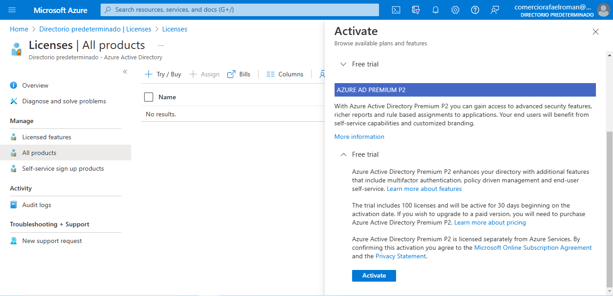
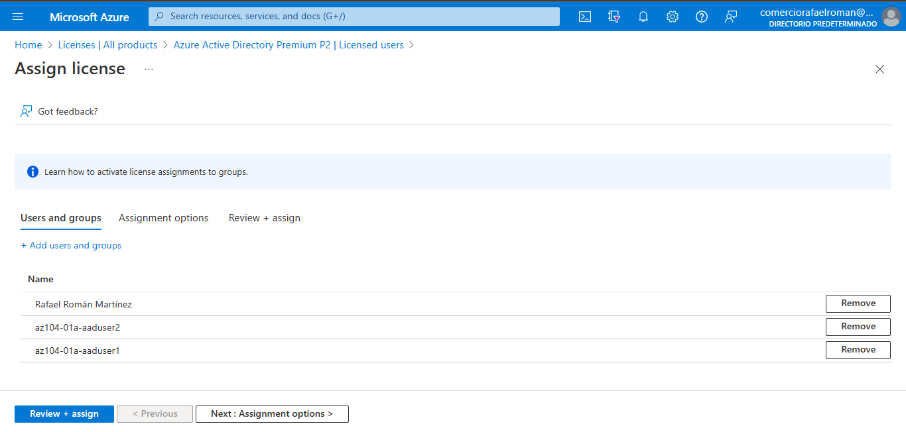

# Lab 01 - Manage Azure Active Directory Identities

## Rafael Román Martínez

### Enero 2023

## Objectives

- Task 1: Create and configure Azure AD users
- Task 2: Create Azure AD groups with assigned and dynamic membership
- Task 3: Create an Azure Active Directory (AD) tenant (Optional - lab environment issue)
- Task 4: Manage Azure AD guest users (Optional - lab environment issue).

#### Task 1: Create and configure Azure AD users

1. Sign in to the [Azure portal](https://portal.azure.com/).

2. In the Azure portal, search for and select **Azure Active Directory**.

   

3. On the Azure Active Directory blade, scroll down to the **Manage** section, click **User settings**, and review available configuration options.

   

4. On the Azure Active Directory blade, in the **Manage** section, click **Users**, and then click your user account to display its **Profile** settings.

   

5. Click **edit**, in the **Settings** section, set **Usage location** to **United States** and click **save** to apply the change.

   

   

   > **Note**: This is necessary in order to assign an Azure AD Premium P2 license to your user account later in this lab.

6. Navigate back to the **Users - All users** blade, and then click **+ New user**.

   

7. Create a new user with the following settings (leave others with their defaults):

   | Setting                    | Value                         |
   | :------------------------- | :---------------------------- |
   | User name                  | **az104-01a-aaduser1**        |
   | Name                       | **az104-01a-aaduser1**        |
   | Let me create the password | enabled                       |
   | Initial password           | **Provide a secure password** |
   | Usage location             | **United States**             |
   | Job title                  | **Cloud Administrator**       |
   | Department                 | **IT**                        |

   > **Note**: **Copy to clipboard** the full **User Principal Name** (user name plus domain). You will need it later in this task.

   

   

8. In the list of users, click the newly created user account to display its blade.

   

9. Review the options available in the **Manage** section and note that you can identify the Azure AD roles assigned to the user account as well as the user account’s permissions to Azure resources.

   

10. In the **Manage** section, click **Assigned roles**, then click **+ Add assignment** button and assign the **User administrator** role to **az104-01a-aaduser1**.

    

    

    > **Note**: You also have the option of assigning Azure AD roles when provisioning a new user.

11. Open an **InPrivate** browser window and sign in to the [Azure portal](https://portal.azure.com/) using the newly created user account. When prompted to update the password, change the password to a secure password of your choosing.

    

    

    > **Note**: Rather than typing the user name (including the domain name), you can paste the content of Clipboard.

12. In the **InPrivate** browser window, in the Azure portal, search for and select **Azure Active Directory**.

    

    > **Note**: While this user account can access the Azure Active Directory tenant, it does not have any access to Azure resources. This is expected, since such access would need to be granted explicitly by using Azure Role-Based Access Control.

13. In the **InPrivate** browser window, on the Azure AD blade, scroll down to the **Manage** section, click **User settings**, and note that you do not have permissions to modify any configuration options.

14. In the **InPrivate** browser window, on the Azure AD blade, in the **Manage** section, click **Users**, and then click **+ New user**.

15. Create a new user with the following settings (leave others with their defaults):

    | Setting                    | Value                         |
    | :------------------------- | :---------------------------- |
    | User name                  | **az104-01a-aaduser2**        |
    | Name                       | **az104-01a-aaduser2**        |
    | Let me create the password | enabled                       |
    | Initial password           | **Provide a secure password** |
    | Usage location             | **United States**             |
    | Job title                  | **System Administrator**      |
    | Department                 | **IT**                        |

    

    

    

16. Sign out as the az104-01a-aaduser1 user from the Azure portal and close the InPrivate browser window.

#### Task 2: Create Azure AD groups with assigned and dynamic membership

In this task, you will create Azure Active Directory groups with assigned and dynamic membership.

1. Back in the Azure portal where you are signed in with your **user account**, navigate back to the **Overview** blade of the Azure AD tenant and, in the **Manage** section, click **Licenses**.

   > **Note**: Azure AD Premium P1 or P2 licenses are required in order to implement dynamic groups.
   >
   > 

2. In the **Manage** section, click **All products**.

3. Click **+ Try/Buy** and activate the free trial of Azure AD Premium P2.

4. Refresh the browser window to verify that the activation was successful.

> **Note**: It can take up to 10 minutes for the licenses to activate. Continue refreshing the page until it appears. Do not proceed until the licenses have been activated.

5. From the **Licenses - All products** blade, select the **Azure Active Directory Premium P2** entry, and assign all license options of Azure AD Premium P2 to your user account and the two newly created user accounts.

   

6. In the Azure portal, navigate back to the Azure AD tenant blade and click **Groups**.

7. Use the **+ New group** button to create a new group with the following settings:

| Setting           | Value                               |
| :---------------- | :---------------------------------- |
| Group type        | **Security**                        |
| Group name        | **IT Cloud Administrators**         |
| Group description | **Contoso IT cloud administrators** |
| Membership type   | **Dynamic User**                    |

> **Note**: If the **Membership type** drop-down list is grayed out, wait a few minutes and refresh the browser page.
>
> 

8. Click **Add dynamic query**.

9. On the **Configure Rules** tab of the **Dynamic membership rules** blade, create a new rule with the following settings:

| Setting  | Value                   |
| :------- | :---------------------- |
| Property | **jobTitle**            |
| Operator | **Equals**              |
| Value    | **Cloud Administrator** |

10. Save the rule by clicking **+Add expression** and **Save**. Back on the **New Group** blade, click **Create**.

11. Back on the **Groups - All groups** blade of the Azure AD tenant, click the **+ New group** button and create a new group with the following settings:

| Setting           | Value                                |
| :---------------- | :----------------------------------- |
| Group type        | **Security**                         |
| Group name        | **IT System Administrators**         |
| Group description | **Contoso IT system administrators** |
| Membership type   | **Dynamic User**                     |

12. Click **Add dynamic query**.

13. On the **Configure Rules** tab of the **Dynamic membership rules** blade, create a new rule with the following settings:

| Setting  | Value                    |
| :------- | :----------------------- |
| Property | **jobTitle**             |
| Operator | **Equals**               |
| Value    | **System Administrator** |

14. Save the rule by clicking **+Add expression** and **Save**. Back on the **New Group** blade, click **Create**.

15. Back on the **Groups - All groups** blade of the Azure AD tenant, click the **+ New group** button, and create a new group with the following settings:

| Setting           | Value                             |
| :---------------- | :-------------------------------- |
| Group type        | **Security**                      |
| Group name        | **IT Lab Administrators**         |
| Group description | **Contoso IT Lab administrators** |
| Membership type   | **Assigned**                      |

16. Click **No members selected**.

17. From the **Add members** blade, search and select the **IT Cloud Administrators** and **IT System Administrators** groups and, back on the **New Group** blade, click **Create**.

18. Back on the **Groups - All groups** blade, click the entry representing the **IT Cloud Administrators** group and, on then display its **Members** blade. Verify that the **az104-01a-aaduser1** appears in the list of group members.

> **Note**: You might experience delays with updates of the dynamic membership groups. To expedite the update, navigate to the group blade, display its **Dynamic membership rules** blade, **Edit** the rule listed in the **Rule syntax** textbox by adding a whitespace at the end, and **Save** the change.
>
> 

19. Navigate back to the **Groups - All groups** blade, click the entry representing the **IT System Administrators** group and, on then display its **Members** blade. Verify that the **az104-01a-aaduser2** appears in the list of group members.

#### Task 3: Create an Azure Active Directory (AD) tenant (Optional - Lab environment issue)

In this task, you will create a new Azure AD tenant.

> **Note**: There is a known issue with the Captcha verification in the lab environment. If you experience this issue, please skip both this task and the next. We are working on a solution.

1. In the Azure portal, search for and select **Azure Active Directory**.

2. Click **Manage tenants**, and then on the next screen, click **+ Create**, and specify the following setting:

   | Setting        | Value                      |
   | :------------- | :------------------------- |
   | Directory type | **Azure Active Directory** |

   

   

3. Click **Next : Configuration**

   | Setting             | Value                                                        |
   | :------------------ | :----------------------------------------------------------- |
   | Organization name   | **Contoso Lab**                                              |
   | Initial domain name | any valid DNS name consisting of lower case letters and digits and starting with a letter |
   | Country/Region      | **United States**                                            |

   > **Note**: The **Initial domain name** should not be a legitimate name that potentially matches your organization or another. The green check mark in the **Initial domain name** text box will indicate that the domain name you typed in is valid and unique.

   

4. Click **Review + create** and then click **Create**.

5. Display the blade of the newly created Azure AD tenant by using the **Click here to navigate to your new tenant: Contoso Lab** link or the **Directory + Subscription** button (directly to the right of the Cloud Shell button) in the Azure portal toolbar.

   

#### Task 4: Manage Azure AD guest users.

In this task, you will create Azure AD guest users and grant them access to resources in an Azure subscription.

1. In the Azure portal displaying the Contoso Lab Azure AD tenant, in the **Manage** section, click **Users**, and then click **+ New user**.

   

2. Create a new user with the following settings (leave others with their defaults):

   | Setting                    | Value                         |
   | :------------------------- | :---------------------------- |
   | User name                  | **az104-01b-aaduser1**        |
   | Name                       | **az104-01b-aaduser1**        |
   | Let me create the password | enabled                       |
   | Initial password           | **Provide a secure password** |
   | Job title                  | **System Administrator**      |
   | Department                 | **IT**                        |

   

3. Click on the newly created profile.

   > **Note**: **Copy to clipboard** the full **User Principal Name** (user name plus domain). You will need it later in this task.

   

4. Switch back to your default Azure AD tenant by using the **Directory + Subscription** button (directly to the right of the Cloud Shell button) in the Azure portal toolbar.

   

5. Navigate back to the **Users - All users** blade, and then click **+ Invite external user**.

6. Invite a new guest user with the following settings (leave others with their defaults):

   | Setting        | Value                                                   |
   | :------------- | :------------------------------------------------------ |
   | Name           | **az104-01b-aaduser1**                                  |
   | Email address  | the User Principal Name you copied earlier in this task |
   | Usage location | **United States**                                       |
   | Job title      | **Lab Administrator**                                   |
   | Department     | **IT**                                                  |

   

   

7. Click **Invite**.

8. Back on the **Users - All users** blade, click the entry representing the newly created guest user account.

   

9. On the **az104-01b-aaduser1 - Profile** blade, click **Groups**.

   

10. Click **+ Add membership** and add the guest user account to the **IT Lab Administrators** group.

    

#### Task 5: Clean up resources